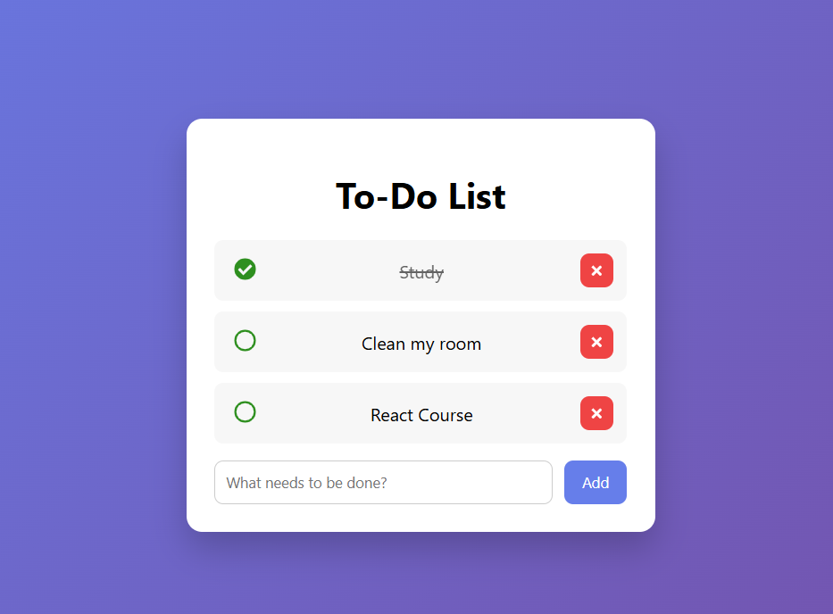

# 📝 To-Do List App (React)

A simple, clean, and user-friendly To-Do List application built with React.
The app allows users to add, complete, and delete tasks, with automatic saving using Local Storage so tasks persist after refreshing the page.

---

## ✨ Features

- Add new tasks
- Mark tasks as completed
- Delete tasks
- Persistent data using localStorage
- Add tasks using the Enter key
- Clean & modern UI
- Responsive design

---

## 🛠️ Built With

- React (Hooks)
  - useState
  - useEffect
  - useRef
- CSS (custom styling)
- React Icons
- Local Storage API

---

## 🚀 Getting Started

### 1. Clone the repository
git clone https://github.com/LamaShaban/todo-list-react.git

### 2. Navigate to the project folder
cd todo-list-react

### 3. Install dependencies
npm install

### 4. Run the app
npm start

The app will run on:
http://localhost:3000

---

## 💾 Local Storage

- Tasks are loaded from localStorage when the app starts
- Any change (add / delete / complete) is automatically saved
- Tasks remain after page refresh or browser restart

---

## 📂 Project Structure

src/
│── App.js
│── App.css
│── index.js

---

## 🌱 Future Improvements

- Filter tasks (All / Active / Completed)
- Dark mode
- Edit task text

---

## 👩‍💻 Author

Lama Shaban  
Frontend Developer (React)

---

